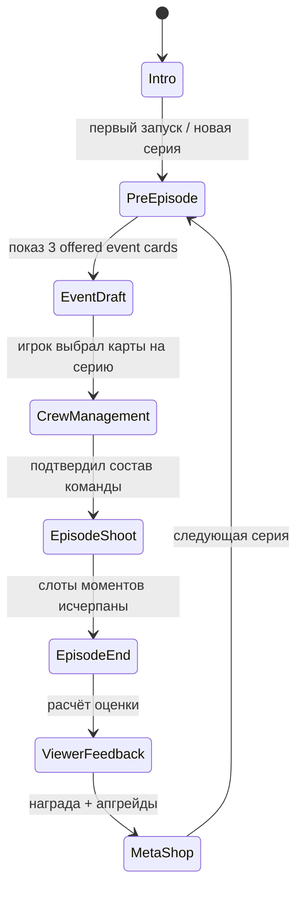

# Reality Show Director — GDD + планы реализации (Unity 2D)

**Тема геймджема:** «Только самое нужное»  
**Рабочее название:** TBD (рабочий коднейм: `RealityDirector`)  
**Команда:** 5 человек (ты + 4) · **Джем:** **1.5 дня** полной реализации  
**Референсы:** локация — *The Sims 4* (квартира); съёмка — *We Become What We Behold* (кадр / reticle / слоты).

---

## 0. Два этапа — не путать scope

| | **Pitch prototype (СЕЙЧАС)** | **Jam build (1.5 дня)** |
|---|------------------------------|-------------------------|
| **Зачем** | Показать 4 людям и **заинfectить** идеей; согласовать, что делаем на джеме | Играбельный сезон, мета, контент |
| **Длина показа** | **3–5 мин** live demo + 2 мин слайды «куда растём» | **15–20 мин** прохождение сезона |
| **Играбельный loop** | **Один** эпизод-сценка, без save | Intro → meta loop → 6 серий → финал |
| **Ивенты** | **2–3** (главное — одна «злая» карта + реакция) | **15–20** в data, баланс |
| **Meta** | **Мок** (картинка/UI-заглушка или 1 статичный экран) | Draft, Crew lvl 1–5, shop, экономика §4 |
| **Критерий успеха** | Команда говорит «да, это наше» и понимает роли | Заливаем билд на джем |

**Правило для ИИ сейчас:** реализуй только **§0.1–§0.4 и Phase P***. Всё остальное в документе — **vision для джема**, не обязательный код до питча.

### 0.1 Что должно «щёлкнуть» у команды (pillars)

1. **Ты режиссёр, не участник** — провоцируешь, не бегаешь.
2. **Карта ивента → хаос** — видимая причинно-следственная связь (холодильник / разозлить).
3. **Характеры** — два NPC реагируют **по-разному** на одно и то же.
4. **We Become What We Behold** — один (или два) слота кадра; «я поймал момент».
5. **Зрители** — экран с 2–3 отзывами по **именам из сцены** (хоть шаблон).

### 0.2 Pitch demo script (~3 мин)

Подготовь билд так, чтобы ведущий мог пройти без объяснений:

1. *(15 с)* Текст на экране: «Ты — режиссёр реалити. Создай драму. Сними хайлайт.»
2. *(30 с)* Два NPC на кухне/гостиной idle; внизу **2–3 иконки карт** (уже «в руке», без draft).
3. *(60 с)* Играет **`provoke`** на злого → **`fridge_fire`** на холодильник → добряк паникует, злой идёт к добряку → **Fight** (партикл/тряска достаточно).
4. *(60 с)* Режим камеры → reticle → **Space** → слот заполнился (иконка + имена NPC).
5. *(30 с)* Второй кадр или кнопка «Конец серии» → **3 отзыва зрителей**, одна строка с «{Zloi} дал по роже…», оценка **7/10**.
6. *(30 с)* Переключение на **Vision screen**: картинка/meta mock — draft, три карты команды, магазин ивентов («на джеме»).

### 0.3 Scope pitch prototype — делать

- Одна сцена `Apartment_Pitch`: **2–3 комнаты**, placeholder art норм.
- **2 NPC**, primary trait виден в UI (иконка/подпись).
- **3 event** SO, в demo выданы сразу **2–3** без meta.
- Targeting: Object + Actor минимум.
- **ReactionRuleSet:** минимум 4 actions — `Idle`, `Flee`/`Panic`, `SeekFight`, `Fight`.
- **Capture:** 1–2 слота; end episode когда слоты full или кнопка debug.
- **Feedback:** 3 hardcoded/template строки, завязанные на `MomentTag:Fight` / имена.
- **VisionScreen** (UI only): неиграбельный макет meta из §2 + §4 — для слайда после demo.

### 0.4 Scope pitch — НЕ делать (перенос на джем)

- Save/load, второй эпизод подряд, `GameStateMachine` на все фазы (достаточно `PitchFlow`: Play → Feedback → Vision).
- Draft, Writers/Operators/Cast leveling, деньги, shop, `ProgressionConfig`, season length.
- 3+ NPC, hidden traits reveal, NavMesh polish — **waypoints** ок.
- Intro cinematic, main menu, звук beyond 1–2 sfx.
- `EventCatalog` 15–20 (достаточно коммент в md).

### 0.5 Роли на джеме (черновик для обсуждения с командой)

| Роль | Pitch | Jam |
|------|-------|-----|
| **Code / GD** | vertical slice §0.3 | meta, economy, state machine |
| **Art / UI** | комната + карточки + reticle + Vision mock | полный UI hub, портреты, 6 NPC |
| **Content** | 3 ивента, 2 персонажа, 5 строк feedback | 15–20 ивентов, traits, wishes |
| **Audio** | — | sfx, музыка стресс/комedy |
| **QA / trailer** | прогон demo script | баланс 15–20 мин, запись гиф |

*На питче достаточно 1–2 человек в коде; таблица чтобы 4 человека увидели, куда встанут.*

---

## 1. Elevator pitch (vision — jam)

Игрок — режиссёр реалити-шоу. Между сериями: выбор ивент-карт, менеджмент команды (операторы / сценаристы / «актёры» как лимит участников), трата заработка на прокачку и новые карты. В серии: одна локация (дом), NPC-участники с характерами реагируют на провокации и друг на друга; игрок **создаёт драму ивентами** и **фиксирует слоты «моментов»** через камеру. После серии — фидбек зрителей, оценка, деньги, цикл повторяется.

**Принцип «только нужное» на джеме:** один дом, data-driven реакции, шаблоны зрителей, без LLM/мультиплеера.

---

## 2. Игровой цикл (macro loop) — jam



### 2.1 Этапы (детально)

| Этап | Игрок делает | Системы |
|------|----------------|---------|
| **Intro** | Скип/прочитать 2–3 экрана | `NarrativeSequence`, save flag `HasSeenIntro` |
| **Event draft** | Из 3 offered выбрать N (N = уровень сценаристов + база) | `EventCardPool`, `DraftUI` |
| **Crew management** | Пассивно видит уровни карт; опционально апгрейд если есть деньги *до* серии — см. Meta | `CrewCardState`, `UpgradeUI` |
| **Episode shoot** | Ивенты на объекты/NPC, наблюдение, съёмка моментов | `Location`, `NPC`, `EventExecutor`, `CameraCapture` |
| **Viewer feedback** | Читает 3–5 отзывов, итоговый балл | `FeedbackGenerator`, `EpisodeScore` |
| **Meta shop** | Покупка ивентов, апгрейд Operators/Writers/Cast | `Economy`, `Progression` |

**Важно для ИИ:** Meta shop может быть **в начале** следующей серии (как в описании) — один экран «Подготовка серии» = Draft + Crew + Shop в одном flow.

---

## 3. Core gameplay (episode)

### 3.1 Локация (Sims-like, упрощённо)

- **Структура:** одна квартира = **граф комнат** или **список зон** (Kitchen, LivingRoom, Bedroom, Bathroom). Связи — двери/проёмы (waypoints).
- **Объекты:** интерактивные `Interactable` (Fridge, Stove, Shower, Sofa…) с тегами (`Appliance`, `Comfort`, `SocialSpot`).
- **NPC navigation:** 2D, `NavMesh` (NavMeshPlus) или простой **waypoint + A* по сетке**; для прототипа достаточно «идти к точке / к объекту / к NPC».
- **Камера:** фиксированный вид сверху или slight angle; зум опционален. Игрок **не** управляет персонажем — только курсор для ивентов и режима съёмки.

### 3.2 Ивент-карты

**Типы targeting (MVP):**

1. **Object** — клик по объекту после выбора карты (поджечь холодильник, отключить воду).
2. **Actor** — клик по NPC (разозлить, подстрекнуть).
3. **Global** — без таргета (отключить горячую воду во всём доме).

**Pipeline:**

1. Игрок выбирает карту в hand UI → режим targeting.
2. Валидация цели → `EventDefinition` применяется → `WorldEvent` в шину событий.
3. Визуал/звук (спрайт, партикл, булев флаг на объекте `IsOnFire`).
4. NPC с `ReactionRules` слушают `WorldEvent` и ставят задачи в `BehaviorQueue`.

**Примеры карт (контент-таблица для ScriptableObject):**

| Id | Target | Effect | Триггер для feedback |
|----|--------|--------|----------------------|
| `fridge_fire` | Fridge | Fire flag, smoke | `MomentTag:Fire`, `Chaos` |
| `no_hot_water` | Global | Shower disabled 120s | `MomentTag:Misery` |
| `provoke` | Actor | +Rage buff 60s | `MomentTag:Conflict` |
| `hide_camera` | Global | -1 capture slot temp | не в v0 |

**Каталог на полную игру (15–20, дописать SO по мере production):**

`fridge_fire`, `no_hot_water`, `provoke`, `cut_wifi`, `spoiled_food`, `broken_ac`, `love_triangle_rumor`, `hidden_mic`, `swap_beds`, `steal_phone`, `slam_door`, `fake_pregnancy_news`, `invite_ex`, `alcohol_in_coffee`, `power_outage`, `release_rat`, `glue_on_chair`, `confession_cam`, `meditation_bell`, `double_date_challenge` — *точный список правится в `EventCatalog`; в v0 живут только первые 3.*

### 3.3 NPC участники

**Атрибуты (MVP):**

- `displayName`, `portrait`
- **Primary trait** (видимый): `Aggressive`, `Timid`, `Sentimental`, …
- **Hidden traits** (скрыты до reveal): `Kleptomaniac`, `Nag`, `Gullible`, …
- **Needs (упрощённо):** Hunger, Social, Stress (0–100) — опционально в MVP, можно заменить на «idle в комнате + реакция только на events»
- **Relationship** к другому NPC: -100..100

**Reveal hidden trait (прототип):**

- Условие в data: «если участник был в кадре при `MomentTag:Theft`» → reveal `Kleptomaniac`.
- Или: 3-й конфликт с тем же NPC → reveal.

**Поведение (не полный GOAP — rule stack):**

```
On WorldEvent:
  foreach rule in PersonalityRules:
    if rule.Matches(event, self):
      EnqueueAction(rule.Action) // Flee, ApproachAndInsult, Cry, Fight, Watch
```

**Примеры:**

- `Timid` + `Fire` → `Flee` к Bedroom.
- `Aggressive` + `Provoked` → `SeekTarget` добрый NPC → `Fight` (анимация + relationship -20).
- `Sentimental` + `FriendCried` → `Comfort`.

### 3.4 Съёмка моментов (We Become What We Behold)

**Режим:** toggle «Камера» или удержание ПКМ — **reticle** в центре экрана или следует за курсором.

**Capture rule (MVP):**

- В кадре должен быть **хотя бы один NPC** (опционально: нужен specific `MomentTag` активный в последние T секунд).
- `CaptureValidator` проверяет: bounds reticle ∩ NPC collider, line of sight не обязателен в MVP.
- Успех → заполнить **следующий пустой слот оператора** (`CapturedMoment`: screenshot или staged icon + tags + involved actors).

**Слоты:** `OperatorLevel` → count slots (lvl1 = 1, lvl2 = 2, …). Когда все слоты заполнены → `EpisodeShoot` завершается (кнопка «Закончить серию» disabled — только auto end).

**Moment tags:** при capture система собирает активные теги с NPC/сцены (`Fighting`, `Crying`, `Fire`, `Slap`, …) из последних N секунд буфера событий — для feedback.

---

## 4. Мета: карты команды и экономика

### 4.1 Карты команды (уровни 1–5, max)

| Уровень | **Cast** (NPC на локации) | **Operators** (слоты моментов / серия) | **Writers** (plays + draft) |
|---------|---------------------------|----------------------------------------|-----------------------------|
| **1** | 2 | 1 | 2 plays; draft: **2 из 3** offered |
| **2** | 3 | 2 | 3 plays; **2 из 4** |
| **3** | 4 | 3 | 3 plays; **3 из 5** |
| **4** | 5 | 4 | 4 plays; **3 из 5**; reroll draft **1×** |
| **5** | 6 | 5 | 5 plays; **4 из 6**; reroll **1×** |

*«Актёры»* = лимит участников на съёмке, не playable. Новый NPC при апгрейде Cast подтягиется из `CastRoster` (уникальные trait-пairs, часть locked до эпизода N).

**Прототип v0:** UI/логика уровней 1–5 в data; контент NPC можно иметь 4–6 prefab, на сцене спawn по `CastLevel`.

### 4.2 Длина сезона (~15–20 мин)

Ориентир для `ProgressionConfig` (тюнится в playtest):

| Блок | Время |
|------|-------|
| Intro + обучение (серия 1 с подсказками) | ~2–3 мин |
| Одна серия (meta + съёмка + feedback) | ~2.5–4 мин early → ~3–5 min late (больше NPC/ивентов/кадров) |
| **Сезон** | **5–6 серий** → **~15–18 мин**; 7-я как epilogue optional |

**Финал сезона:** триггер когда `EpisodeIndex >= SeasonLength` (default 6) **или** игрок взял «Grand Finale» draft — показать титры, итог сезона (средний рейтинг, лучший момент). Для jam достаточно hard cap на 6 серий.

**Интерес на 15–20 мин (не только числа):**

- Эп. 1–2: мало актёров, зрители просят «новое лицо» / «больше драмы в комнате».
- Эп. 3–4: в коллекции 5–8 ивентов, комбинации, hidden traits раскрываются.
- Эп. 5–6: высокий chaos (6 NPC, 4–5 кадров, 4–5 plays) — игрок **режиссёр**, а не кликер одной карты.

### 4.3 Экономика и pacing апгрейдов

**Доход:**

- `episodeScore` = среднее отзывов 1–10 (см. §4.5).
- `payout = BasePayout * (episodeScore / 10) * CastHypeBonus * WishlistBonus`
- `CastHypeBonus`: +0% (cast 2) … +25% (cast 6) — **награждает рост ensemble**.
- `WishlistBonus`: одноразово **×1.3**, если выполнен `ViewerWish` прошлой серии (часто «добавьте участника» → ап Cast).

**Расходы (стартовые числа, всё в SO):**

| Переход | Cast | Operators | Writers |
|---------|------|-----------|---------|
| 1→2 | **70** | 90 | 90 |
| 2→3 | 110 | 130 | 130 |
| 3→4 | 160 | 180 | 180 |
| 4→5 | 220 | 240 | 240 |

**Слоты прогресса за сезон:** при score ~7–8 игрок зарабатывает **~95–120**/серию → **~570–720** за 6 серий. Сумма всех апгрейдов 1→5 по **одной** ветке ≈ **560**; по **трём** ≈ **1680**. **Max всего не купить** — нужно **чередовать** ветки (3×4 = 12 апгрейдов до max аккаунта ≈ 1680, денег не хватит → типичный билд **Cast 4–5**, **Operators 3–4**, **Writers 2–4** + 2–4 новых ивента).

**Покупка ивент-карт:** 100–180 по tier; pool unlocked по `EpisodeIndex` и min Cast (soft).

### 4.4 Направление игрока: сначала Cast, но не линейно

**Цель дизайна:** в среднем игрок **раньше** качает **Cast** (больше тел = больше реакций и score ceiling), затем **Operators** (больше «хитов» за серию) и **Writers** (больше провокаций). **Не** сценарий «max Cast → max Op → max Writers».

**Мягкие рычаги (без hard locks):**

1. **Дешевле Cast 1→2 и 2→3** (см. таблицу) + **ViewerWish** после эп.1 с бонусом за Cast.
2. **Score formula:** часть очков за capture — `UniqueActorsInFrame` и `RelationshipDelta`; при Cast 2 потолок ниже, чем при Cast 4 при тех же Operators.
3. **Ивенты в магазине:** tier-2+ карты дают **+score только если** на локации ≥3 NPC (tooltip в UI, не блок покупки).
4. **Дешевле первый апгрейд Operators**, если Cast ≥3 (promo `-20%`, один раз) — подталкивает «уже вырос ensemble → снимай лучше».
5. **Writers 4–5** сильны, но **бесполезны без** chaos: при Cast ≤2 feedback штраф «слишком скучно, мало героев» (−0.5 к среднему), не запрет plays.

**Пример типичного билда (не единственного):**

| После серии | Частое решение |
|-------------|----------------|
| 1 | Cast 2→3 |
| 2 | Cast 3→4 *или* Operators 1→2 |
| 3 | Writers 1→2 + купить ивент |
| 4 | Operators 2→3 |
| 5 | Cast 4→5 *или* Writers 2→3 |
| 6 | последний апгрейд «что не хватает для финала» |

**Anti-linear:** promo на Operators при Cast≥3; дорогие Cast 4→5 когда уже есть альтернатива вложиться в Writers; **reroll draft** только Writers 4+ — reason качать Writers mid-season.

**Для ИИ:** реализовать `ProgressionConfig` + `UpgradePricing` + `ViewerWish` + формулы bonus/penalty; не скриптовать «forced build order».

### 4.5 Viewer feedback (генерация без LLM)

**Вход:** список `CapturedMoment` (tags, actors), история `WorldEvent` за серию, relationships delta.

**Выход:** 3–5 `ViewerReview { score 1-10, text template filled }`.

**Шаблоны (ScriptableObject + string.Format):**

- «Понравилось, наконец-то {AggressiveName} дал по роже {VictimName}!» — условие: tag `Slap` or `Fight`.
- «Хотелось бы увидеть, как {TimidName} расплакался» — если не было `Crying` + trait Timid alive.

**Scoring:** +1–2 если moment совпал с `ViewerWish`; штраф «мало героев» если `CastLevel <= 2` и episode ≥3; базово 6–9 при Conflict tag.

**ViewerWish (meta hook):** после feedback генерировать **1 wish** на следующую серию (`AddCast`, `MoreShots`, `MoreDrama`, `NamedActorCry`, …) — текст для UI + id для `WishlistBonus`.

---

## 5. UI / UX (экраны)

1. **MainMenu** — New Game / Continue (optional).
2. **IntroOverlay** — текст + art.
3. **PreEpisodeHub** — секции: Event Draft | Crew (read-only levels + Upgrade buttons) | Shop | Start Episode.
4. **EpisodeHUD** — hand of event cards (icons), remaining plays, operator slots (filled/empty), pause.
5. **CaptureOverlay** — reticle, подсказка «Space — снять».
6. **PostEpisode** — scroll reviews, total score, money + continue.

**Input:** New Input System уже в проекте (`Assets/Settings/InputSystem_Actions.inputactions`) — привязать UI submit, capture, cancel targeting.

---

## 6. Архитектура Unity (для реализации ИИ)

### 6.1 Структура папок

```
Assets/
  Docs/                          # этот файл
  Data/                          # ScriptableObjects
    Events/
    Traits/
    FeedbackTemplates/
    EpisodeConfig/
  Prefabs/
    NPC/
    Interactables/
    UI/
  Scenes/
    Bootstrap.unity              # GameManager, dontdestroy
    Apartment.unity              # gameplay
  Scripts/
    RealityDirector/
      Core/                      # GameStateMachine, EpisodeContext
      Location/
      NPC/
      Events/
      Capture/
      Meta/
      UI/
      Persistence/
```

### 6.2 Ключевые классы (контракты)

| Компонент | Ответственность |
|-----------|-----------------|
| `GameStateMachine` | Intro → PreEpisode → Episode → Feedback → PreEpisode |
| `EpisodeContext` | runtime: hand, plays left, slots, active NPC list |
| `EventDefinition` SO | id, target type, prefab VFX, world effects, tags |
| `EventBus` / `WorldEvent` | struct: type, source, target ids, timestamp |
| `NPCController` | traits, action queue, animation state |
| `ReactionRuleSet` SO | mapping event → action priority |
| `CaptureSystem` | validate, fill slot, raise `MomentCaptured` |
| `FeedbackGenerator` | moments + log → reviews |
| `SaveData` | JSON или PlayerPrefs для jam |

### 6.3 Game State Machine (enum)

```csharp
public enum GamePhase {
  Intro,
  PreEpisode,
  EpisodeShoot,
  PostEpisodeFeedback
}
```

Episode sub-state: `TargetingEvent`, `Playing`, `CaptureMode` (можно overlay flag).

---

## 7. Контент

### 7.1 Pitch slice (серия-одиночка)

- **NPC:** 2 — «Злой» (Aggressive), «Добряк» (Sentimental).
- **Ивенты в HUD:** `provoke`, `fridge_fire`, третий `no_hot_water` optional.
- **Operator slots:** 1 (must) или 2 (если быстро).
- **Beat для demo:** provoke → fire → fight → capture → feedback (§0.2).

### 7.2 Jam — обучающая серия 1

**Цель сезона:** §4.2 (~15–20 мин).

- **NPC:** 2 на старте; roster расширяется с Cast.
- **Hidden (1 на персонажа):** у Zлого — Nag; у Добряка — Gullible (reveal после провокации).
- **Ивенты в draft:** 3 offered, игрок берёт 2 (Writer lvl1).
- **Operator lvl1:** 1 фото.
- **Обязательный beat:** поджог холодильника → трусливость не у Zлого, но Sentimental panics / Aggressive идёт бить → игрок ловит fight в кадр.
- **Feedback:** минимум 3 строки, итог 7/10, деньги на первый апгрейд или карту `provoke`.

---

## 8. Out of scope

**Pitch (§0.4)** — не кодить до питча.

**Jam — не делать в 1.5 дня (резать первыми):**

- Мультиэтажный дом, outdoor, транспорт.
- LLM-отзывы, полный VA, локализация.
- Multiplayer, монетизация.
- Больше 5 lvl / второй сезон / NG+.

---

## 9. Риски и упрощения

| Риск | Mitigation |
|------|------------|
| NavMesh 2D setup | Использовать NavMeshPlus или grid waypoints между door nodes |
| «Интересный кадр» неочевиден | Подсветка NPC при Conflict; tutorial hint |
| Баланс ивентов | Writers limit plays; cooldown на карту |
| WBWWH feel без арта | Сильный vignette в capture mode + freeze frame 0.2s |

---

## 10. Задачи для ИИ-агента

**Сейчас — только Phase P.** Phase A–F — **после питча / на джеме**.

### Phase P — Pitch prototype (priority)

- [ ] **P1.** Сцена `Apartment_Pitch`: tilemap/placeholder, Fridge interactable, 2 spawn points.
- [ ] **P2.** `NPCController` ×2 + waypoint move; trait SO (Aggressive, Sentimental).
- [ ] **P3.** `EventBus` + 2–3 events + hand UI + targeting (Actor/Object).
- [ ] **P4.** `ReactionRuleSet` → Panic/Fight chain на `fridge_fire` + `provoke`.
- [ ] **P5.** `CaptureSystem` — reticle, 1–2 slots, tag buffer `Fight`.
- [ ] **P6.** `PitchFeedbackUI` — 3 templates by tag/names; score 7/10.
- [ ] **P7.** `VisionScreen` UI mock (draft + 3 crew cards + shop labels).
- [ ] **P8.** `PitchFlow` controller: start → episode → feedback → vision (no save).

**Pitch done когда:** §0.2 demo script проходится без читов за 3–5 мин.

### Phase A–F — Jam (1.5 days, после greenlight)

### Phase A — Skeleton (1–2 сессии)

- [ ] **A1.** `Bootstrap` scene + `GameStateMachine` + пустые переходы фаз.
- [ ] **A2.** `PreEpisodeHub` UI mock (без логики shop) → кнопка Start Episode загружает Apartment additive или single.
- [ ] **A3.** `SaveData` stub (money=0, crew all lvl1).

### Phase B — Location & NPC (2–3 сессии)

- [ ] **B1.** Apartment tilemap/placeholder sprites, 3–4 комнаты, spawn points.
- [ ] **B2.** `Interactable` base + Fridge, Shower placeholders.
- [ ] **B3.** `NPCController` — move to point, idle; 2 prefabs with trait SO.
- [ ] **B4.** Simple pathing (NavMeshPlus or waypoint graph).

### Phase C — Events (2 сессии)

- [ ] **C1.** `EventDefinition` SO + **3** events (fridge_fire, no_hot_water, provoke); `EventCatalog` stub на 15–20 id.
- [ ] **C2.** Hand UI + targeting + `EventBus`.
- [ ] **C3.** `ReactionRuleSet` для Aggressive/Timid/Sentimental + Fight/Flee/Cry actions (anim placeholder).

### Phase D — Capture (1–2 сессии)

- [ ] **D1.** Capture mode + reticle + validator (NPC in frame).
- [ ] **D2.** Operator slots UI + auto end episode.
- [ ] **D3.** Moment buffer (event tags last 5 sec).

### Phase E — Meta loop (1–2 сессии)

- [ ] **E1.** Draft 3 cards, pick N based on Writers level.
- [ ] **E2.** `FeedbackGenerator` + PostEpisode UI.
- [ ] **E3.** Payout, upgrade crew **lvl 1–5**, `ProgressionConfig`, `ViewerWish`, buy event; season length 6.

### Phase F — Polish jam (optional)

- [ ] **F1.** Intro slides.
- [ ] **F2.** Hidden trait reveal popup.
- [ ] **F3.** SFX, screen shake on fight, fire particle.

---

## 11. Промпт-шаблон для подзадач

```
Контекст: Unity 6 2D URP DEMODOM2. GDD: Assets/Docs/GDD_ImplementationPlan.md.
Этап: Pitch → только Phase P и §0. Jam → Phase A–F.
Задача: <P3 / C2 / …>.
Критерий: <для pitch: пункт из §0.2>.
Не делать: §0.4 (pitch) или §8 jam cuts.
```

---

## 12. Data examples (для ScriptableObject)

**TraitDefinition:** `id`, `displayName`, `isHiddenDefault`, `icon`  
**ReactionRule:** `eventTag`, `requiredTrait`, `actionId`, `priority`  
**CapturedMoment:** `textureOrIcon`, `actorIds[]`, `tags[]`, `timestamp`  
**ViewerReview:** `score`, `bodyText`

---

## 13. Критерии готовности

**Pitch (greenlight команды):**

1. Demo script §0.2 без устных «сейчас бы тут было…».
2. Два NPC — разная реакция на fire/provoke.
3. Capture + feedback с **именами** из сцены.
4. Vision screen показывает meta, которой **ещё нет** в коде — команда понимает jam scope.

**Jam (1.5 d):**

5. Intro → Draft → Episode ×6 → финал; ~15–20 мин.
6. Crew 1–5, экономика §4, 3+ ивента playable, catalog 15–20.
7. Save между сериями (минимум PlayerPrefs).

---

*Документ v1.2 — pitch vs jam split.*
